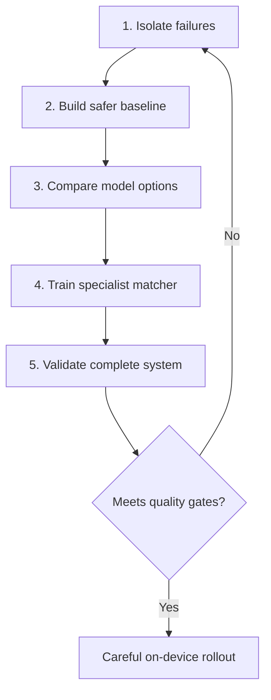
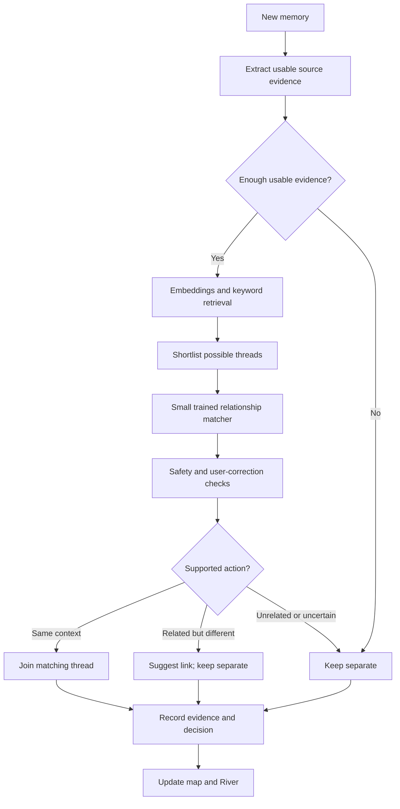

# Remember: a more reliable memory map

Status: recommendation, not implemented. Written 11 September 2026.

## The recommendation

Keep embeddings to **find possible matches**, then use a small, task-trained model to **check whether they belong together**. Apply safety rules before changing threads, and preserve a reversible history of every decision.

Embeddings already come from neural networks. We should adapt an existing model—not train a language model from scratch. The key distinction to teach is: **similar subject does not necessarily mean the same project**.

Our [baseline evaluation](evaluations/2026-09-10-organization-benchmark.md) found that embeddings plus rules missed many correct connections; adding the current local-reasoning fallback created many incorrect connections. Neither pipeline is reliable enough yet. These results do not isolate the model from its surrounding decision logic.

## 1. Recommended improvement sequence

1. **Isolate failures.** Check whether the correct thread reaches the candidate list, whether the model judges it correctly, and whether the organization rules accept the right decision. Test these separately.
2. **Build a safer baseline.** Keep the existing embeddings initially. Improve safeguards and compare a simple learned classifier, such as logistic regression or boosted trees, with the current reasoning fallback.
3. **Compare model options.** Test better multilingual embeddings and specialist matching models separately, changing one component at a time. EmbeddingGemma and Qwen3-Reranker-0.6B are candidates to evaluate, not selected production dependencies.
4. **Train the specialist.** Fine-tune a small pretrained model on Remember-specific relationship examples. A cross-encoder reads both texts together and learns whether they share an actual project or context. Keep the simpler classifier if it performs better for our quality and device constraints.
5. **Validate the complete system.** Use fresh, unseen projects; different arrival orders; multilingual and media inputs; overlapping memberships; and merge/split tests. Measure phone latency, memory, cancellation, and recovery before rollout.

## 2. How the proposed system would work

In simple terms:

1. **Read the evidence.** Use the note, extracted document text, or supported media transcript/caption. Missing evidence is not permission to guess.
2. **Find candidates.** Embeddings find similar meaning; keywords and specific names help find exact context. Retrieval proposes matches—it does not authorize a join.
3. **Check the relationship.** Compare the memory with relevant original sources from each candidate thread, not just its generated title. Distinguish same context, related-but-different, unrelated, and insufficient evidence.
4. **Make a safe decision.** Respect user corrections and use thresholds validated on separate data. Uncertainty leaves a provisional separate thread. Merging whole threads requires stronger evidence than adding one memory.
5. **Preserve provenance.** Record supporting source references, model/policy version, and the decision. Corrections append to history rather than erasing it.

Example: “Juniper meeting moved to the 18th” belongs with the earlier Juniper meeting note. A different neighborhood's meeting stays separate, even if both discuss shade and accessibility. A note discussing both projects may belong to both **without merging the projects**.

## 3. How we would teach the matcher

Training happens offline; the goal is on-device matching during normal app use.

1. Create diverse fictional examples, or use real examples only with appropriate consent. Include similar wording across different projects, revisions within one project, cross-language matches, noisy extraction, and notes spanning multiple projects.
2. Have independent agents label relationships and cite supporting passages. Use separate adjudication for disagreements; retain genuinely ambiguous examples as uncertain. Agent agreement is not proof of correctness.
3. Train the small matcher on the reviewed training examples. Keep evaluation labels independent of the training teacher.
4. Test on entirely separate projects, libraries, and writing templates. Do not randomly split pairs from the same notes across training and testing. More pairs from our existing 360 notes do not equal more independent contexts.

User corrections should immediately constrain organization. They should not silently trigger training or upload private memories.

## 4. What counts as success

- The correct thread appears in the shortlist often enough to be useful.
- Accepted joins are accurate, while fewer genuine connections are missed.
- Uncertain cases remain separate; one bad match cannot cascade into a large wrong merge.
- Multi-project notes, user corrections, and source history remain intact.
- Results remain stable across arrival orders and practical phone workloads.

Track precision, recall, false joins, and the fraction safely automated—not just a model's claimed confidence. The existing benchmark targets are 99% pair precision and 85% recall; these remain goals, not promised outcomes. Fresh heldout data is needed because we have inspected the current benchmark's failures.

## Research behind the recommendation

- [Retrieve and rerank](https://www.sbert.net/examples/sentence_transformer/applications/retrieve_rerank/README.html): the retrieval-then-matching pattern; search relevance still needs adaptation to our task.
- [Ditto](https://arxiv.org/abs/2004.00584): pretrained models adapted for pairwise entity matching, an analogous—not identical—problem.
- [LLM-labeled training data for small matchers](https://arxiv.org/abs/2606.28823): a June 2026 preprint supporting teacher–student experiments, not a guarantee for Remember.

**Bottom line:** better candidate discovery + a specialist matcher + conservative organization rules. Choose the final models by measured Remember quality and device performance, not leaderboard rank alone.
