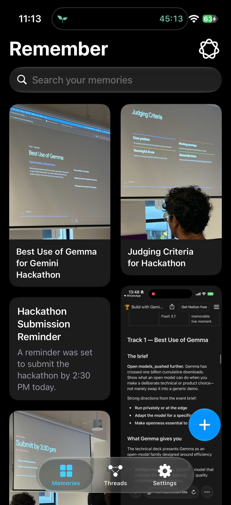
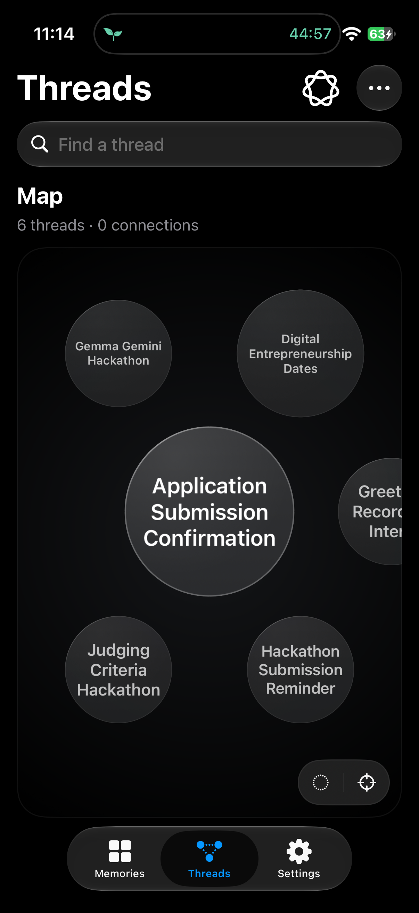
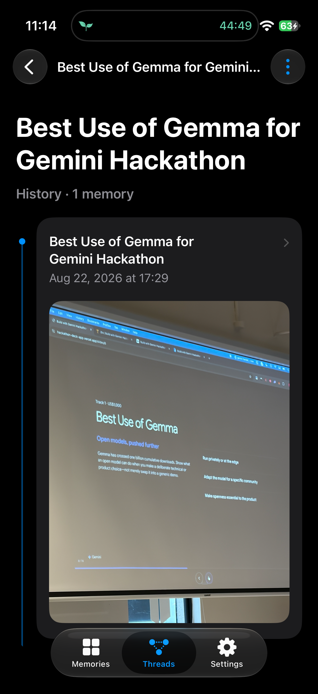
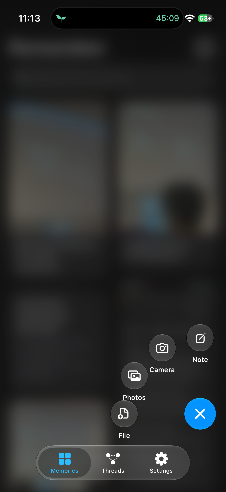
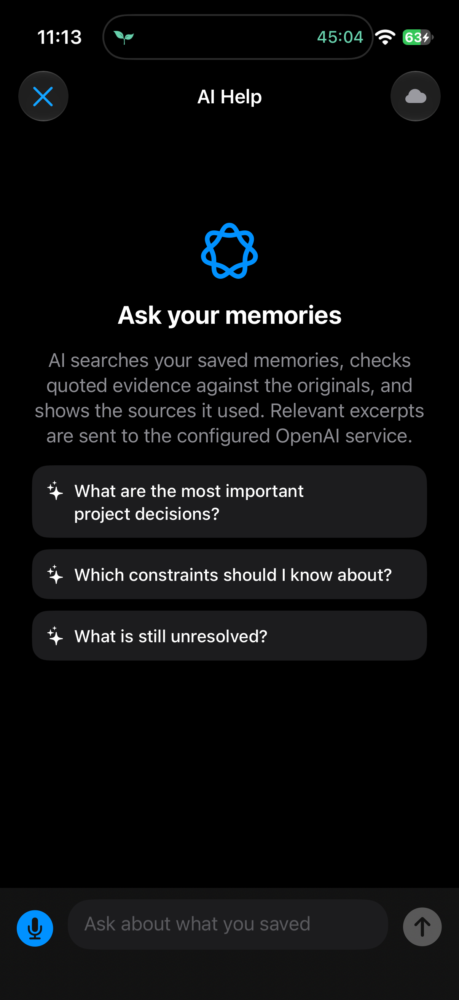
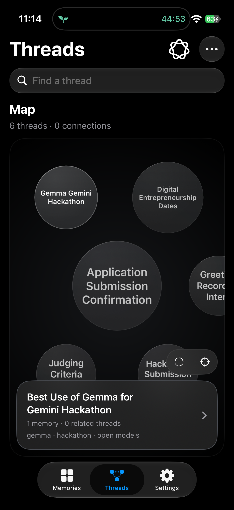
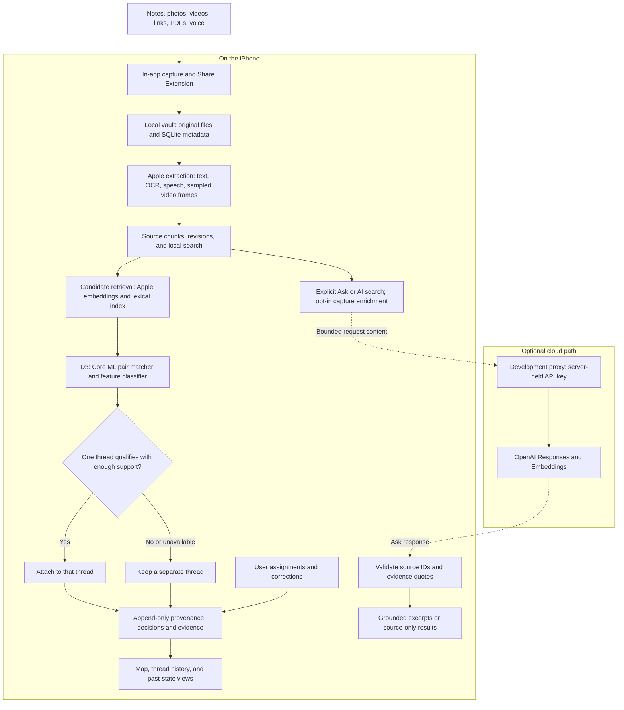

<div align="center">

# Remember

**Save anything. Recover the right context. See how your projects developed—with evidence.**

A native iPhone memory vault that turns scattered notes, photos, videos, links, PDFs, and voice recordings into searchable memories and connected threads.

**SwiftUI · On-device ML · Source-grounded answers · Traceable history**

[Explore the app](#the-experience) · [Architecture](#how-it-works) · [Roadmap](#where-were-heading) · [Run locally](#run-locally)

</div>

## Why Remember

A screenshot captures a detail. A voice note captures an idea. A PDF captures a plan. The context connecting them is usually left for you to remember.

Remember brings those fragments into one place: preserve the original, extract useful evidence, find related memories, and follow how a thread develops over time. You can search what you saved, ask questions with inspectable sources, and revisit earlier decisions without losing their history.

**Our objective is a personal memory system that earns trust:** useful connections, clear evidence, and control over what stays local and what is shared with AI services.

> **Project status:** actively developed iOS prototype. Capture, search, Threads, history, and optional cloud assistance are implemented. Automatic organization is experimental; Remember Pro organization remains a research direction.

The next product emphasis is **provenance-first project memory**, not forcing every
capture into one folder. A shared source may concern several distinct projects;
uncertain associations should remain searchable and reviewable. An isolated,
agent-reviewed offline study is validating these relationships before any app
integration. Optional review inside a River is planned, not shipped; D3 remains
the current organizer. The first two-checkpoint study is complete: ledger integrity
passed, but the new relationship/retrieval policies did not meet their quality gates.
The current source build brings retained-source browsing into **Search your memories**:
use **Include history** for earlier revisions/archived sources or **Source text only**
to exclude generated metadata. Matches open the exact saved version. **Ask AI** stays
separate; this does not enable a new answer verifier or cloud history retrieval.
Local search also tolerates small spelling mistakes in words while keeping numeric
references exact and saved quotations unchanged (installed and verified on iPhone).
[Unified search: behavior and verification](docs/unified-memory-search.md).
[Plan, results, and boundaries](docs/provenance-first.md)

## The experience

<table>
  <tr>
    <th width="33%">Capture and rediscover</th>
    <th width="33%">Explore connections</th>
    <th width="33%">Follow the story</th>
  </tr>
  <tr>
    <td></td>
    <td></td>
    <td></td>
  </tr>
</table>

<details>
<summary><strong>More screens: capture, AI Help, and thread preview</strong></summary>

<table>
  <tr>
    <th width="33%">Capture dial</th>
    <th width="33%">Ask your memories</th>
    <th width="33%">Thread preview</th>
  </tr>
  <tr>
    <td></td>
    <td></td>
    <td></td>
  </tr>
</table>

</details>

*Captured directly from the installed app on a physical iPhone 17 in Dark Mode on 16 September 2026. Screens show the existing library and current Threads interface; no demo memories were added for this capture. The AI Help image shows the entry screen, not a live generated answer.*

| Capability | What you can do |
| --- | --- |
| **Capture across formats** | Save notes, images, videos, links, PDFs, and voice recordings in the app or through the iOS Share Extension. Keep original files in the local vault. |
| **Find what matters** | Search locally, filter the library, and manage tags and collections. Explicit AI search adds hosted semantic retrieval when configured. |
| **Explore Threads** | Browse a draggable memory map, hold a circle for a preview, or search every active thread by name—even those outside the map's 40-circle display window. |
| **Revisit the context** | Read captures and revisions with inline media, inspect organization evidence, view past state, and archive or restore threads. |
| **Ask with sources** | Ask questions about saved material. Evidence quotes are checked against retrieved source text before display, with source-only fallbacks when a grounded answer is unavailable. |
| **Stay in control** | Correct thread assignments, preserve manual decisions, and choose whether to enable cloud capture enrichment. |

The native interface includes Light and Dark Mode, Dynamic Type, VoiceOver labels, and adaptations for Reduce Motion, Reduce Transparency, and Increased Contrast. [Appearance details →](docs/appearance.md)

## Recent updates

- **Threads as the main organization surface.** Direct map entry, inline search across the whole active library, cleaner reading history, and a separate Activity & decisions record. [Interface notes](docs/threads-interface.md)
- **A trained local organizer.** D3 combines Apple embeddings, lexical retrieval, a fine-tuned MiniLM matcher running through Core ML, and corroborating evidence from existing thread members. [Implementation and limits](docs/d3-organization.md)
- **Searchable video evidence.** Captions, on-device speech transcription, and OCR/possible visual labels from sampled frames feed search and thread evidence. Playback stays native; partial coverage is explained and can be retried. [Video indexing](docs/video-indexing.md)
- **Measured next steps for AI.** An isolated cloud context-review pilot informs the Pro direction. iOS 27 compatibility and local-model experiments are in progress; numeric parity remains unresolved and no grouping-quality improvement has been established. [Pro assessment](docs/premium-organization-api.md) · [iOS assessment](docs/ios27-free-tier-assessment.md)

## How it works

The system separates **source preservation**, **evidence extraction**, **organization**, and **answering**. The local path handles capture and thread placement; explicit cloud features cross a separate proxy boundary.



### The engineering behind the experience

**Retrieval proposes; the policy decides.** D3 combines two candidate lists into at most ten memories, scores pairs in both directions, and requires two supporting memories among the first three retrieved members of an established thread—or one for a singleton. Exactly one thread must qualify. Ambiguous captures remain separate, and the organizer never automatically merges existing threads.

The current matcher supports detected English text up to 16,000 Unicode scalars, with a 512-token pair limit in the neural model. Longer material can remain searchable while falling outside automatic matching.

**History is part of the data model.** An append-only provenance ledger records source revisions, placements, corrections, evidence, and policy versions. Read projections reconstruct current and past thread state. Sequence checks reject decisions based on stale state, while manual assignments and existing placements remain protected.

**Media becomes inspectable evidence.** Video indexing samples up to 12 frames and transcribes up to the first 30 minutes of speech. Timestamped frame evidence and coverage notes make the limits visible. This is bounded extraction; brief scenes can be missed and results remain marked partial.

**Answering has a verification boundary.** The cloud response is checked against the retrieved sources before evidence is displayed. Quote verification establishes that the text exists in a source; it does not guarantee that every interpretation of that text is correct.

| Layer | Implementation |
| --- | --- |
| App and interaction | SwiftUI, native media controls, custom map layout and capture-dial motion |
| Persistence | Local file vault, SQLite through GRDB, append-only provenance events |
| Local extraction | Vision, Speech, AVFoundation, PDF/text extraction; Foundation Models enrichment where available |
| Local organization | Natural Language embeddings, lexical features, trained MiniLM through Core ML, frozen decision policy |
| Optional cloud AI | OpenAI Responses and Embeddings through a Python development proxy |
| Verification | Swift Testing, XCTest UI automation, Python evaluation pipelines, saved conversion and parity receipts |

## Privacy and data boundaries

**Cloud capture assistance is off by default.** Capture, local browsing/search, and D3 thread matching do not require an OpenAI key. Apple model assets may need an initial download; unavailable matching leaves captures in separate threads.

Ask and AI search are explicit cloud actions **independent of the capture-assistance toggle**. Depending on the operation, requests can include extracted text, captions, an image being analyzed, memory chunks, a query, or selected excerpts. Video capture extraction stays local. The Share Extension does not call OpenAI.

Original vault files, the database, and local activity metadata remain on the device except for content included in those AI requests. The app sends Responses requests with `store: false`; the API key lives only in the proxy's environment. Production hosting still requires authenticated client access, rate limits, abuse controls, and a published privacy policy.

## Evidence, not just a demo

The repository includes fictional evaluation datasets, frozen protocols, diagnostic reports, and native test receipts. Different checks answer different questions:

| Recorded check | Result | What it establishes |
| --- | --- | --- |
| [Video/search regression](docs/video-indexing.md) | 135 simulator unit tests and 3 UI checks passed; separate iPhone video/speech and navigation checks passed | Recorded functional coverage for extraction, history, search, and playback |
| [D3 conversion and native parity](Evaluation/AppMatcher/VERIFICATION.md) | 16/16 pair decisions agreed in the original port checks | Consistency of the exported model, tokenizer, features, and scorer on those cases |
| [P2 matcher evaluation](Evaluation/MatcherValidation/P2_REPORT.md) | Selected D3 candidate: 95.79% pair precision, 58.39% library-macro recall | Historical pair classification on fictional libraries, not end-to-end grouping quality |
| [Pro context-review pilot](Evaluation/CloudMatcher/pilot-01/REPORT.md) | 93.5% same-project precision, 90.6% recall on 80 context-rich diagnostic packets | Early feasibility of optional cloud review; not an enabled app feature |

These are **recorded results, not a claim that every check passes on every current toolchain**. D3's three-seed qualification failed; the selected model is an experimental integration with remaining grouping errors. Newer iOS 27 toolchain diagnostics leave numeric compatibility unresolved. Neither the pair metrics nor the cloud pilot establish customer accuracy, production readiness, or phone performance at scale.

## Where we're heading

The next objective is to move from a working memory vault to a dependable daily companion: recover more useful context while keeping mistakes visible and correctable.

| Priority | Next objective | Evidence needed before rollout |
| --- | --- | --- |
| **Provenance-first project memory** | Represent overlap and uncertainty, recover source-linked context, and keep project history trustworthy | Two offline checkpoints: reviewed relationship fixtures and ideal-label replay, then frozen-policy/retrieval comparison; optional River review only after separate approval |
| **Device and scale readiness** | Resolve runtime parity and measure the integrated organizer on real iPhones | Cold/warm latency, peak memory, thermal behavior, and large-library tests |
| **Richer local understanding** | Evaluate newer Apple models for context review and image/video evidence | Measured gains over D3, explicit uncertainty, and asset/language compatibility checks |
| **Remember Pro** | Offer opt-in cloud context review as evidence-backed suggestions | Fresh end-to-end evaluation, user acceptance, authenticated entitlements, quotas, and bounded costs |
| **Release readiness** | Harden the cloud boundary and make setup reproducible | Authenticated proxy access, privacy documentation, and a documented model-asset distribution path |

These are development objectives, not shipped features or release-date commitments. New specialist training and RL remain deferred until an observed bottleneck justifies them. [Provenance-first checkpoints](docs/provenance-first.md) · [Local organization design](docs/d3-organization.md) · [Pro launch requirements](docs/premium-organization-api.md)

## Run locally

### iPhone app

1. Open `Remember/Remember.xcodeproj` in Xcode with support for the project's **iOS 26.5 deployment target**.
2. Allow Xcode to resolve the pinned GRDB Swift package.
3. Choose the `Remember` scheme and an eligible simulator. For a physical iPhone, configure signing and the App Group capability for both the app and Share Extension.
4. Build and run. Local capture and browsing do not need a cloud API key.

**Matcher assets:** the development build uses approximately 67 MB of trained Core ML weights. The vocabulary and feature parameters are tracked, but `D3Matcher.mlpackage` is excluded by the repository's model-artifact rules. A fresh source download therefore does not contain the complete organizer. The [export and parity workflow](docs/d3-organization.md#reproducibility-and-validation) requires the existing frozen checkpoint and prepared evaluation environment; it is not a one-command model download. Without the model, automatic matching remains unavailable and captures retain separate threads. Model-execution tests require the asset.

Foundation Models, speech, and embeddings depend on device, language, and asset availability. See the [current compatibility assessment](docs/ios27-free-tier-assessment.md) before assuming a newer OS or Xcode preserves model behavior.

### Optional cloud features

Copy the sanitized environment template from the repository root:

```sh
cp .env.example .env
```

Set `OPENAI_API_KEY` in the ignored `.env`, then start the development proxy:

```sh
python3 server/openai_proxy.py
```

The repository defaults are `OPENAI_MODEL=gpt-5.5` and `OPENAI_EMBEDDING_MODEL=text-embedding-3-small`; your API project needs access to the configured models. The proxy enforces the server-side model selection and does not silently substitute another model.

The simulator uses `http://127.0.0.1:8787/v1`. Set `REMEMBER_OPENAI_BASE_URL` in the Xcode scheme to use a different endpoint. A physical phone needs a secured, reachable proxy address; its own loopback address does not reach the Mac. All proxy environment options are listed in [.env.example](.env.example).

### Build and test

From the repository root:

```sh
# Build without device signing.
xcodebuild -project Remember/Remember.xcodeproj -scheme Remember \
  -sdk iphonesimulator -configuration Debug \
  -derivedDataPath /tmp/RememberBuild CODE_SIGNING_ALLOWED=NO build

# List simulators, then replace SIMULATOR_ID below with an available UUID.
xcrun simctl list devices available
xcodebuild -project Remember/Remember.xcodeproj -scheme Remember \
  -destination 'platform=iOS Simulator,id=SIMULATOR_ID' \
  -derivedDataPath /tmp/RememberBuild CODE_SIGNING_ALLOWED=NO \
  -parallel-testing-enabled NO -only-testing:RememberTests test

# Check development-proxy syntax without making an API call.
python3 -m py_compile server/openai_proxy.py
```

Run fixture-seeding UI tests on a simulator or disposable device. Personal-phone checks must use the documented read-only selections in the [Threads verification guide](docs/threads-interface.md#validation); the broader UI suite can create or alter demo content.

## Explore the implementation

| Path | Start here for |
| --- | --- |
| [`Remember/Remember/`](Remember/Remember/) | SwiftUI app, capture pipeline, vault, search, organizer, and provenance |
| [`Remember/RememberShareExtension/`](Remember/RememberShareExtension/) | Lightweight iOS share-sheet capture |
| [`Remember/Shared/`](Remember/Shared/) | App Group capture-inbox handoff |
| [`Remember/RememberTests/`](Remember/RememberTests/) · [`Remember/RememberUITests/`](Remember/RememberUITests/) | Behavioral, model-integration, media, and interface tests |
| [`server/openai_proxy.py`](server/openai_proxy.py) | Server-side credential boundary for optional AI |
| [`Evaluation/`](Evaluation/) · [`scripts/`](scripts/) | Frozen evaluations, diagnostics, model export, and reproducibility tools |
| [`docs/provenance.md`](docs/provenance.md) | Event history, projections, source evidence, and compatibility notes |

Some internal types retain the earlier **Project** name for compatibility. The current product surface is **Threads**; older reset briefs and evaluation reports describe their respective historical versions. Model attribution is recorded in [D3ModelNotice.txt](Remember/Remember/MatcherAssets/D3ModelNotice.txt) and [third-party notices](Evaluation/THIRD_PARTY_NOTICES.md).
